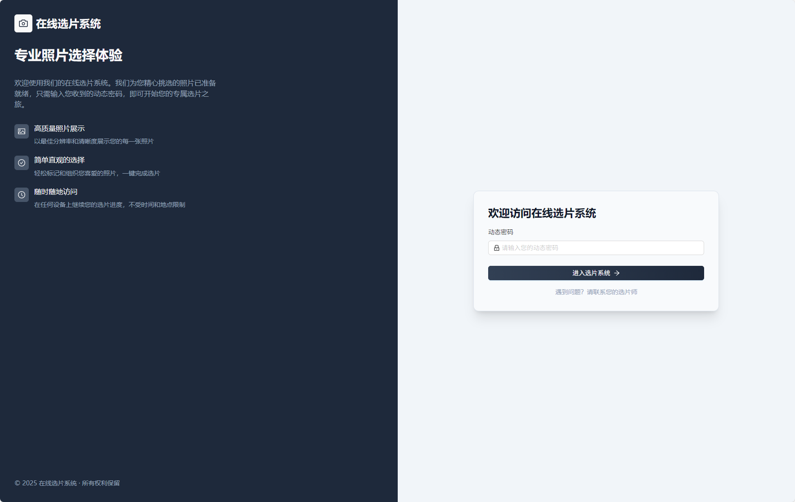
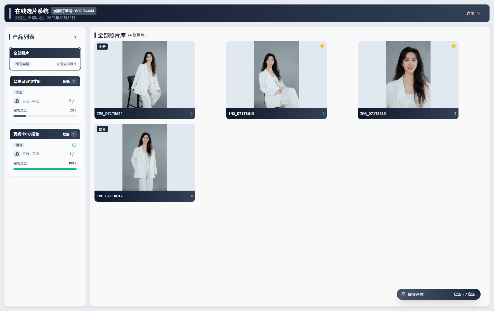
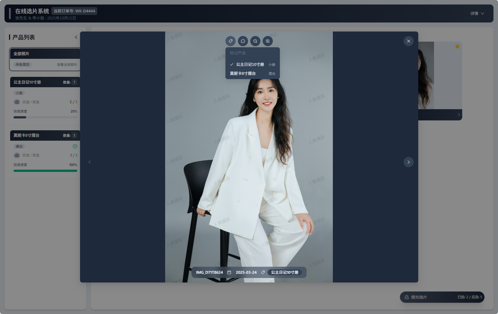
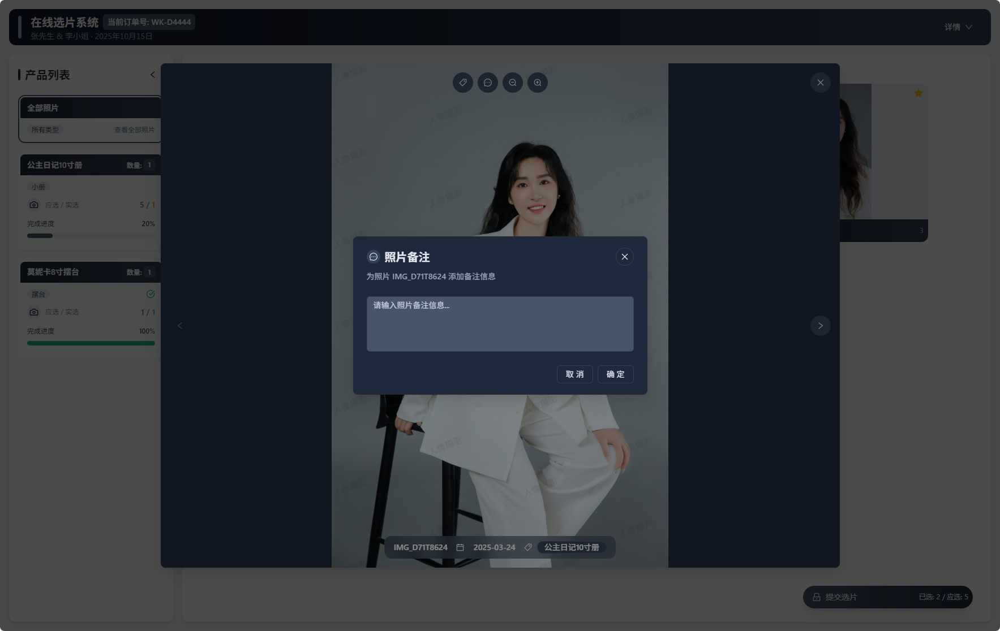
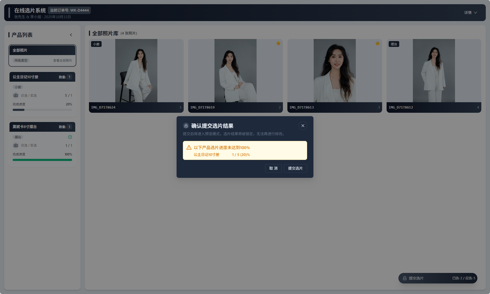

# 📸 Water Moon Client - 在线选片端

这是 Water Moon 系列的一部分，是一个现代化、高端风格的在线选片客户端，专为影楼客户设计，支持照片筛选、产品标记、备注填写等流程操作。

---

## ✨ 项目亮点

- 🎨 高端深色视觉风格 + 响应式设计
- 📂 支持多种产品类型打标（如：入册、摆台、大框等）
- 📝 支持照片备注编辑
- 🔐 动态访问链接 + 密码校验
- 📦 限制照片张数（受套餐约束）
- 🧾 一键提交选片结果

---

## 🖥️ 技术栈

- 🌐 **React 18 + TypeScript**
- 🎨 **Tailwind CSS**
- 📦 状态管理：Zustand
- 🔗 接口通信：Axios + RESTful API
- 🗂️ 文件存储：Minio OSS
- 🛠️ 构建工具：Vite

---

## 🚀 快速开始

### 1. 克隆项目

```bash
git clone https://github.com/yourname/water-moon-client.git
cd water-moon-client
```

## 🖼️ 项目截图（Screenshots）
### 📌 登录页面


### 📌 选片界面


### 📌 产品标记 + 备注功能



### 📌 提交选片


## 🤝 参与贡献（Contributing）

项目目前还不完善，欢迎任何形式的贡献！无论是大佬指点，提交 bug、提建议、添加功能，还是改进文档，都是对项目的重要支持
